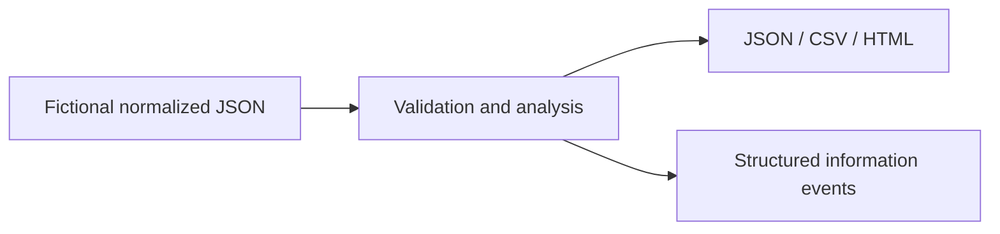

# PowerShell Automation Labs

Robert Rowan's original portfolio starters for identity, Microsoft 365 and systems
automation. All audit examples use fictional normalized input. No proprietary source
or claims of production deployment are included.

Requires PowerShell 7.2+; validated locally on PowerShell 7.6.5. WPF additionally
requires Windows and an STA session. No modules or credentials are needed for offline labs.

## Project catalog

| Project | Entry point | Implemented scope |
| --- | --- | --- |
| User lifecycle simulator | [Invoke-UserLifecycle.ps1](entra-id/Invoke-UserLifecycle.ps1) | Create/update/disable proposed user records, group/license assignments, plan validation and ShouldProcess. Emits a simulated state only; no tenant writes. |
| AD health report | [Get-AdHealthReport.ps1](active-directory/Get-AdHealthReport.ps1) | Evaluates supplied DC reachability/replication/DNS evidence, stale-object candidates, lab password threshold and FSMO records. It does not collect live AD evidence. |
| Group membership analyzer | [Get-GroupAnalysis.ps1](active-directory/Get-GroupAnalysis.ps1) | Traverses nested groups, flags cycles, privileged users, unresolved members and a depth limit. Privilege is supplied by fixtures, not discovered from a tenant. |
| M365 license auditor | [Get-LicenseAudit.ps1](microsoft-graph/Get-LicenseAudit.ps1) | Examines normalized license and service-plan assignments; CSV and HTML outputs flag disabled licensed users, enabled unlicensed users and non-successful plans. These are review candidates, not license-policy conclusions. |
| Mailbox auditor | [Get-MailboxAudit.ps1](exchange-online/Get-MailboxAudit.ps1) | Reports external forwarding, delegates, FullAccess and shared-mailbox ownership review from normalized fixtures. No Exchange connection. |
| Parallel framework | [Invoke-ParallelLab.ps1](automation/Invoke-ParallelLab.ps1) | Runs sample integer jobs in bounded runspaces, retries simulated transient failures, emits structured success/failure records and shows parent progress. Not an arbitrary remote execution framework. |
| WPF console | [Show-LabConsole.ps1](powershell-gui/Show-LabConsole.ps1) | Windows-only fictional user grid with asynchronous PowerShell worker, UI timer, disabled refresh during work and cleanup. Syntax-checked on macOS; actual WPF behavior is not yet verified on Windows. |
| Graph wrapper module | [GraphLab.psm1](microsoft-graph/GraphLab.psm1) | Fixture paging plus explicit live GET using a supplied secure token, trusted-host validation, bounded paging and retries. No token acquisition or tenant writes. |

## Run offline examples

Run in PowerShell from the repository root:

```powershell
./entra-id/Invoke-UserLifecycle.ps1 -StatePath samples/lifecycle-state.json -ChangesPath samples/lifecycle-changes.json -WhatIf
./entra-id/Invoke-UserLifecycle.ps1 -StatePath samples/lifecycle-state.json -ChangesPath samples/lifecycle-changes.json -Confirm:$false
./active-directory/Get-AdHealthReport.ps1 -InputPath samples/ad-health.json
./active-directory/Get-GroupAnalysis.ps1 -InputPath samples/groups.json
./microsoft-graph/Get-LicenseAudit.ps1 -InputPath samples/licenses.json
./microsoft-graph/Get-LicenseAudit.ps1 -InputPath samples/licenses.json -Format Html
./exchange-online/Get-MailboxAudit.ps1 -InputPath samples/mailboxes.json
./automation/Invoke-ParallelLab.ps1 -Items 1,2,3 -FailOnce
Import-Module ./microsoft-graph/GraphLab.psm1
Get-GraphLabUsers -FixturePath samples/graph-pages.json
./tests/Test-Labs.ps1
```

Output is on the success stream; structured lifecycle/audit events use information
stream 6. Redirect `6>$null` to capture a clean report in PowerShell. Scripts do not
write report files unless you explicitly redirect output. Avoid overwriting real data.

Expected fixture results: two lifecycle users; AD replication Fail and DNS Unknown;
cycle/privileged/unresolved group findings; DisabledWithLicense and NoLicense exceptions;
external mailbox forwarding; squared values with two attempts after FailOnce; two Graph users.
See [samples](samples/) and each folder README for examples and limits.

## Architecture and limits



The live Graph reader is opt-in through its AccessToken parameter. Acquire a short-lived
Graph token outside the repository using approved authentication tooling. Use only the
permissions required for the selected fields. See [Microsoft list-users documentation](https://learn.microsoft.com/en-us/graph/api/user-list?view=graph-rest-1.0)
and [pagination guidance](https://learn.microsoft.com/en-us/graph/paging).
The reader has no national-cloud, token refresh, streaming or incremental-checkpoint support;
its live path is not tenant-validated. Do not commit tokens or real exports.

Offline tests check syntax, lifecycle output and unchanged input, AD findings, license
exceptions, group traversal, mailbox findings, runspace retries/exhaustion, fixture paging,
and the WPF platform guard. GitHub Actions runs those checks without tenant credentials.
The WPF interface requires a separate Windows visual check; no screenshot is fabricated.

The original Get-FileInventory.ps1 exercise remains available. Related repositories:
[Entra toolkit](https://github.com/robrow850/entra-automation-toolkit),
[Python labs](https://github.com/robrow850/python-automation),
[infrastructure labs](https://github.com/robrow850/infrastructure-labs).
